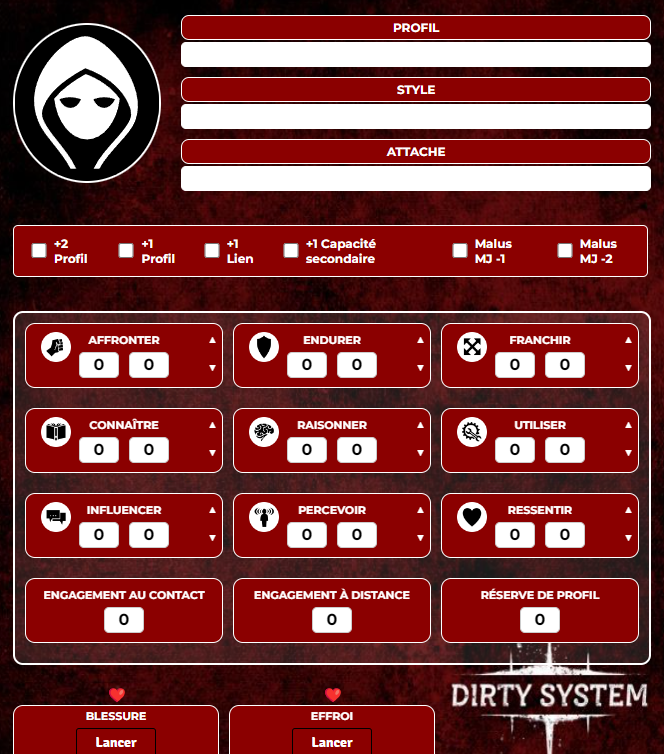

# Dirty System

Le Dirty System est un système de règles français créé par le Label Dirty Clean Crew.  
Il s'agit de la fiche officielle pour Foundry VTT.

## Mentions légales

Le Dirty System est un jeu du Label Dirty Clean Crew.  
Toute la propriété intellectuelle leur appartient. Ce système est une adaptation destinée à fonctionner sous Foundry VTT.  
L'ensemble du code est sous licence Creative Commons.

### Bêta

D'autres fonctionnalités et projets devraient arriver au cours de l'année 2025.  
Des bugs peuvent survenir, si vous en rencontrez, je suis disponible sur Discord (neolenaz).

### Comment télécharger le système

Voici le manifeste : [https://github.com/Fumble-Neo/dirty-system/raw/main/system.json](https://github.com/Fumble-Neo/dirty-system/raw/main/system.json)  
Copiez ce lien, puis ouvrez Foundry VTT. Dans l'application, allez dans la section pour installer un système. Collez le lien dans le champ "URL du manifeste" et cliquez sur "Installer".

### Liens 

- https://label-dcc.games/
- https://label-dcc.games/dirty-system/
- https://linktr.ee/LazarBaruk
- https://linktr.ee/LinouMajorZero

## Preview

Neo.
